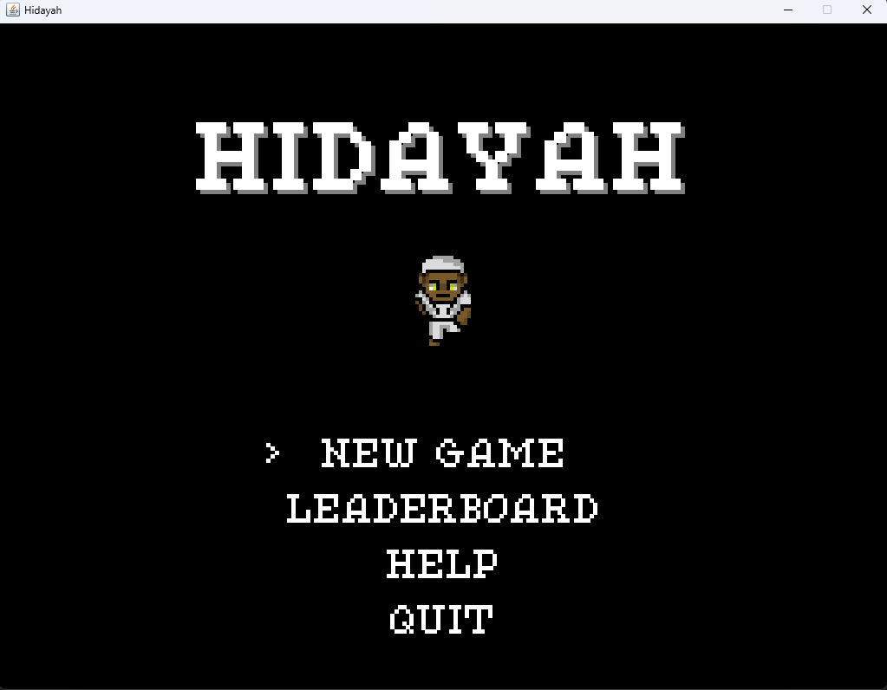
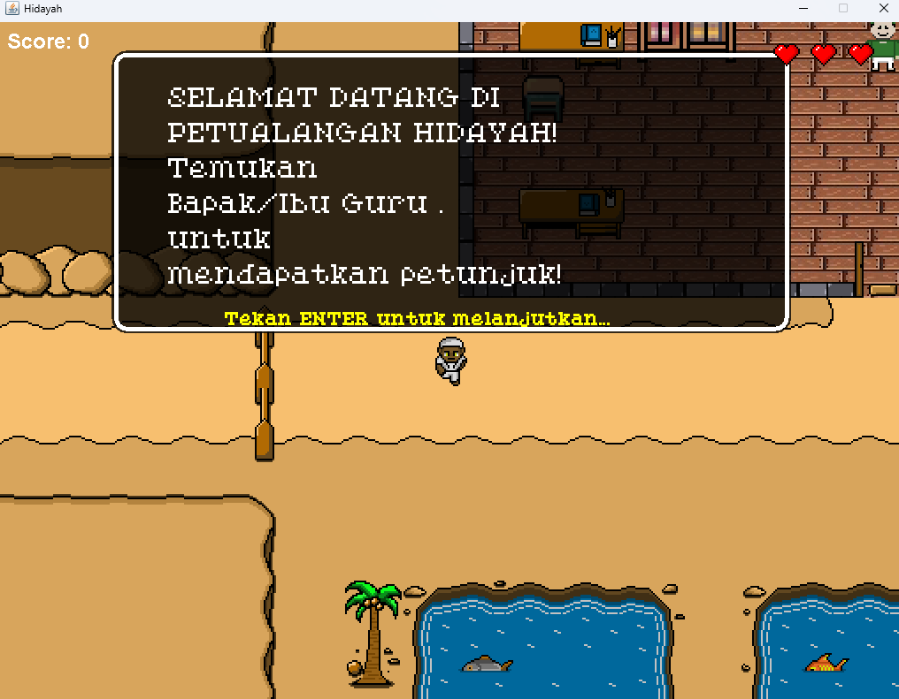
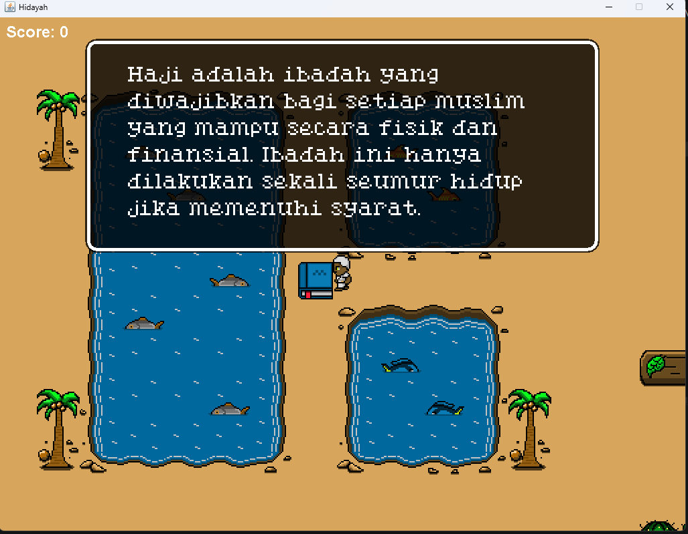

# Hidayah 🕌

Game RPG edukasi berbasis tile yang mengajarkan pengetahuan agama Islam. Pemain menjelajahi dunia 2D, berinteraksi dengan NPC, dan menjawab kuis tentang Rukun Islam untuk menyelesaikan permainan.

---

## Tampilan Game

> 
> 
> 
---

## Fitur

- 🗺️ **Dunia tile-based 2D** — Peta dunia luar, masjid, dan ruang kelas yang bisa dijelajahi
- 🧑‍🤝‍🧑 **NPC interaktif** — Ustadz dan karakter lain yang memberikan petunjuk
- 📚 **Sistem kuis** — Tiga sesi kuis tentang Rukun Islam dengan tiga tingkat kesulitan (Easy, Normal, Hard)
- ❤️ **Sistem nyawa** — Pemain memiliki nyawa yang berkurang jika salah menjawab
- 💾 **Save & Load** — Progres permainan bisa disimpan dan dilanjutkan
- 🎵 **Musik & efek suara** — BGM dan SFX untuk setiap situasi dalam game
- 🏆 **Leaderboard** — Skor pemain dicatat ke database MySQL dan ditampilkan

---

## Prasyarat

Pastikan semua tools berikut sudah terinstall:

| Tool | Versi | Link |
|------|-------|------|
| Java JDK | 8 atau lebih baru | [download](https://www.oracle.com/java/technologies/downloads/) |
| XAMPP | Terbaru | [download](https://www.apachefriends.org) |
| MySQL Connector/J | Terbaru | [download](https://dev.mysql.com/downloads/connector/j/) |

---

## Cara Menjalankan

### 1. Clone repository

```bash
git clone https://github.com/USERNAME/Hidayah.git
cd Hidayah
```

### 2. Setup database

1. Buka **XAMPP Control Panel** → klik **Start** pada **Apache** dan **MySQL**
2. Buka browser → `http://localhost/phpmyadmin`
3. Klik **New** → buat database bernama `game_database` → klik **Create**
4. Pilih database `game_database` → klik tab **Import**
5. Klik **Choose File** → pilih file `database/game_database.sql`
6. Klik **Import**

### 3. Tambahkan MySQL Connector

1. Download **MySQL Connector/J** (format ZIP) dari [sini](https://dev.mysql.com/downloads/connector/j/)
2. Ekstrak dan ambil file `mysql-connector-j-x.x.x.jar`
3. Taruh di folder `lib/` dalam project ini

### 4. Jalankan game

**Menggunakan VS Code:**

Pastikan file `.vscode/settings.json` berisi:
```json
{
    "java.project.sourcePaths": ["src", "res"],
    "java.project.outputPath": "bin",
    "java.project.referencedLibraries": [
        "lib/**/*.jar"
    ]
}
```
Lalu jalankan `src/main/Main.java`.

**Menggunakan terminal:**

```bash
javac -cp "lib/*" -d bin -sourcepath src src/main/Main.java
java -cp "bin;res;lib/*" main.Main
```

---

## Kontrol

| Tombol | Aksi |
|--------|------|
| `W` / `↑` | Gerak ke atas |
| `S` / `↓` | Gerak ke bawah |
| `A` / `←` | Gerak ke kiri |
| `D` / `→` | Gerak ke kanan |
| `Enter` | Interaksi / Konfirmasi |
| `Escape` | Pause / Menu |

---

## Struktur Project

```
Hidayah/
├── src/                    # Source code Java
│   ├── main/               # Core sistem game
│   │   ├── Main.java       # Entry point
│   │   ├── GamePanel.java  # Game loop utama
│   │   ├── UI.java         # Antarmuka pengguna
│   │   ├── KeyHandler.java # Input keyboard
│   │   ├── Sound.java      # Sistem audio
│   │   ├── CollisionChecker.java
│   │   ├── AssetSetter.java
│   │   ├── FileManager.java
│   │   └── UtilityTool.java
│   ├── entity/             # Karakter dalam game
│   │   ├── Entity.java     # Base class semua entity
│   │   ├── Player.java     # Karakter pemain
│   │   ├── NPC_Satu.java ~ NPC_Empat.java
│   │   └── Buku1/2_Easy/Normal/Hard.java
│   ├── object/             # Objek dalam game
│   │   ├── SuperObject.java
│   │   ├── OBJ_Key.java
│   │   ├── OBJ_Heart.java
│   │   ├── OBJ_Diploma.java
│   │   └── ...
│   ├── quiz/               # Sistem kuis
│   │   ├── Quiz.java       # Base class kuis
│   │   ├── quizOne.java    # Kuis Rukun Islam
│   │   ├── quizTwo.java
│   │   └── quizThree.java
│   └── tile/               # Sistem tile/peta
│       ├── Tile.java
│       ├── TileManager.java
│       └── Map.java
├── res/                    # Resource / aset game
│   ├── font/               # Font pixel art
│   ├── maps/               # Data peta (.txt)
│   ├── npc/                # Sprite NPC
│   ├── objects/            # Sprite objek
│   ├── player/             # Sprite pemain
│   ├── sound/              # Musik dan efek suara
│   └── tiles/              # Gambar tile
├── database/
│   └── game_database.sql   # Skema & data leaderboard
├── lib/                    # Library eksternal (tidak di-commit)
│   └── mysql-connector-j-*.jar
├── .vscode/
│   └── settings.json       # Konfigurasi VS Code
├── .gitignore
└── README.md
```

---

## Teknologi

- **Bahasa:** Java
- **GUI:** Java Swing (JFrame, JPanel)
- **Audio:** Java Sound API
- **Database:** MySQL via JDBC (MySQL Connector/J)
- **IDE:** VS Code / Eclipse
- **Resolusi:** 768 × 576 piksel (tile 48×48, skala 4×)
- **FPS:** 60

---

## Dibuat Oleh

> Adidya Darmawan
> Haikal Jamil
> Faroz Syakir
> Lukmanul Hakim

---

## Lisensi

Project ini dibuat untuk tujuan edukasi.